# Flask Deployment Confirmations

### Create Azure VM

  
1. Deploy Azure VM
  
 
 

 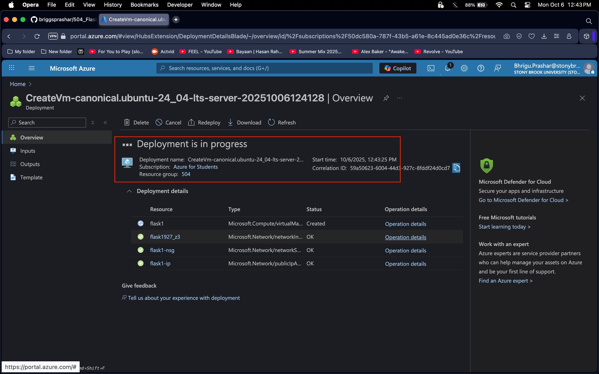

 

 

 

  
2. Azure VM created
  
 
 

 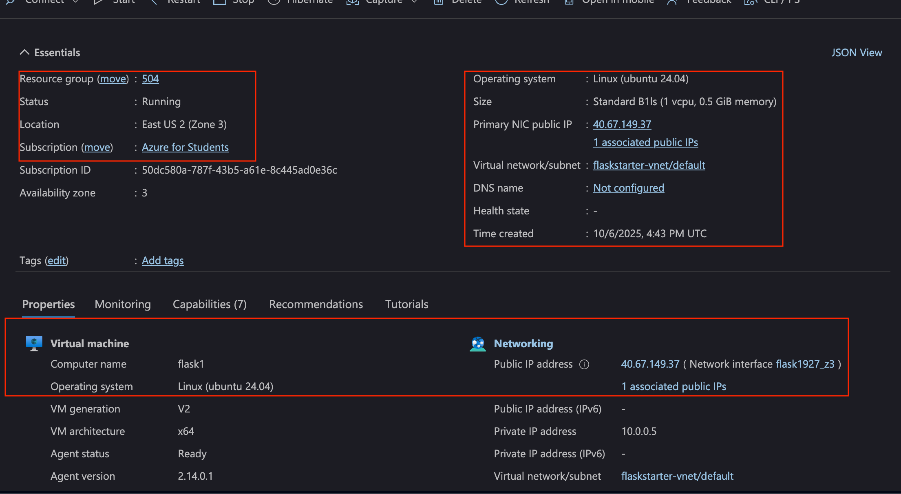

 

### Configure Azure VM

  
3. Port Accessible from source IPs
  

 

 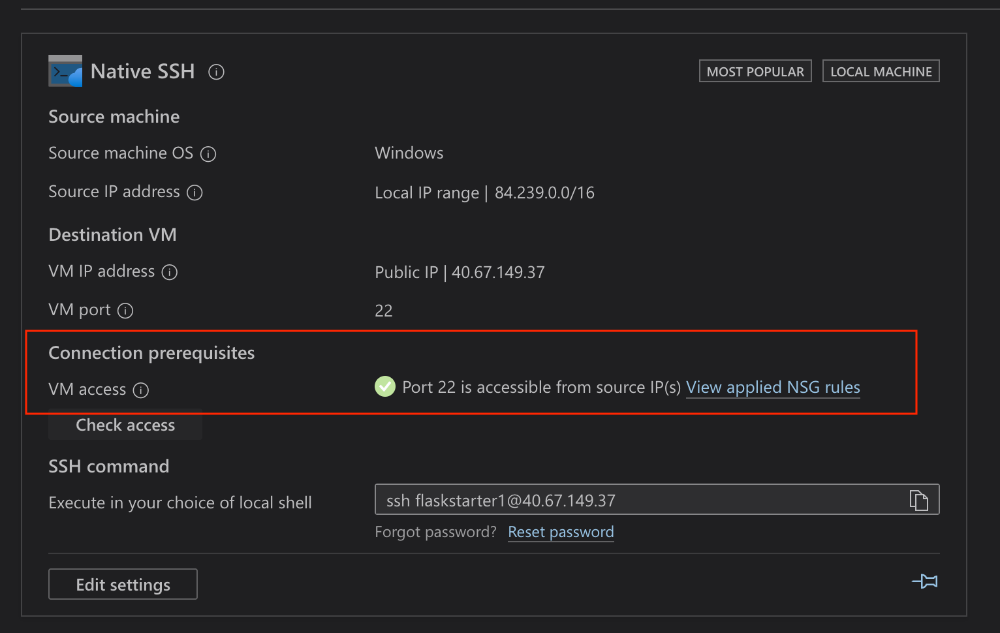

 

  
4. Port 5003
  

 

 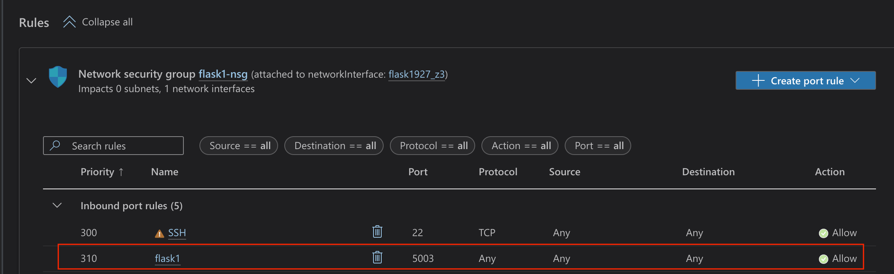

### Local terminal

  
5. Connect to VM via SSH
  

 

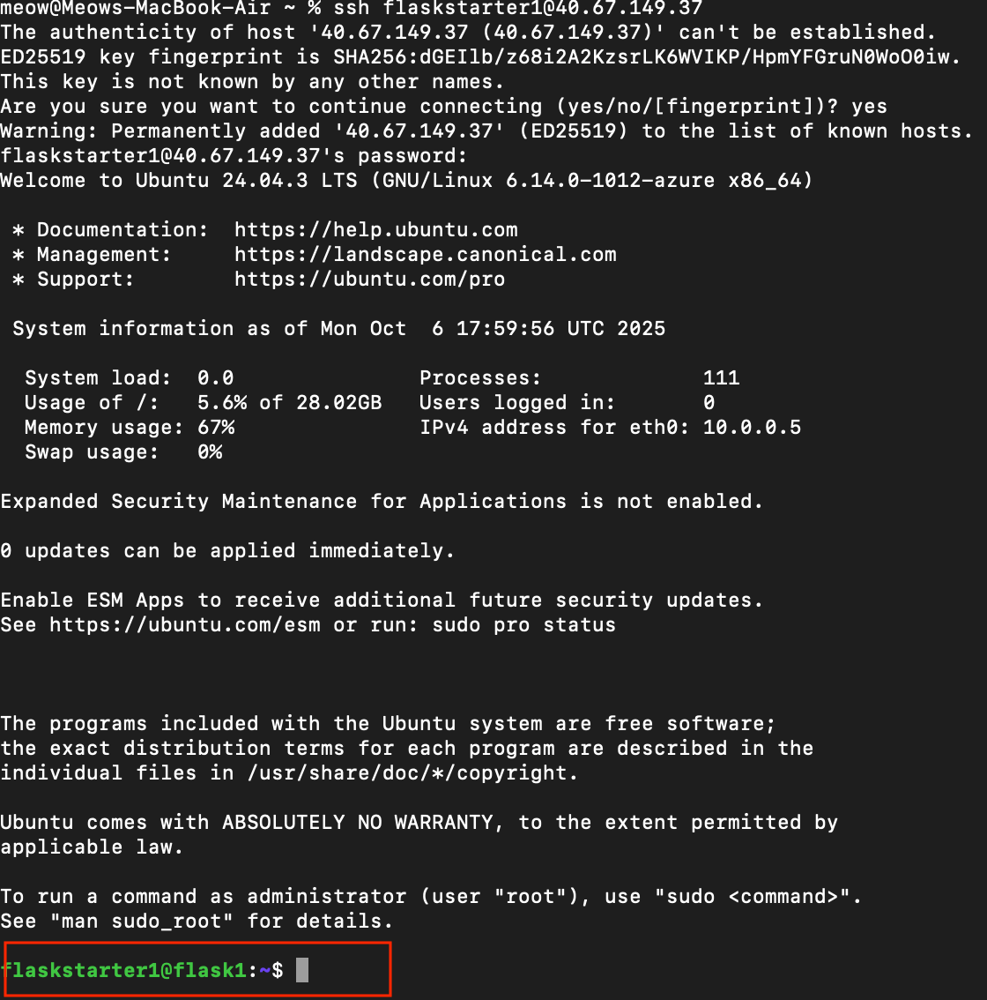

 

  
6. Sudo Updates
  

 

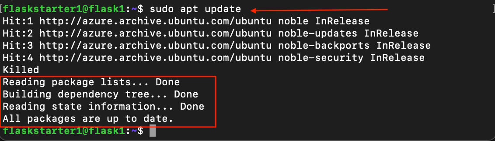

 

  
7. Update Python
  

 

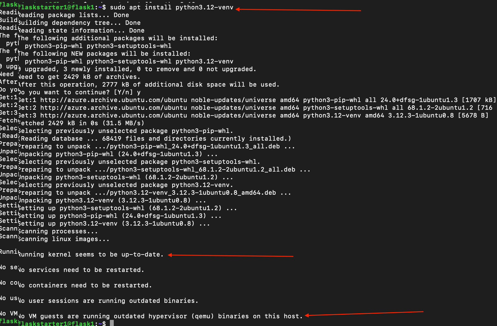

### Environment

  
8. Create environment
  

 

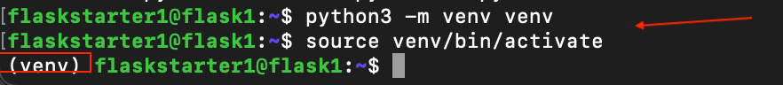

### Github

  
9. Clone to Github Repo & create local path 
  

 

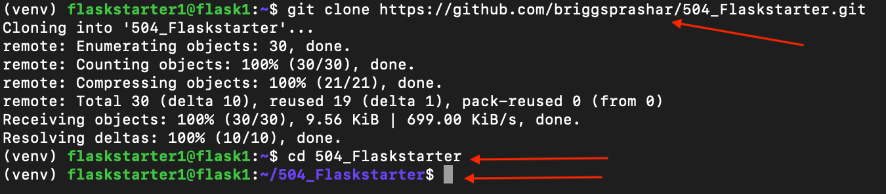

 

  
10. Install requirements 
  

 

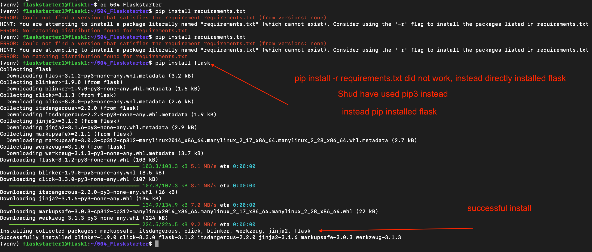

### Run Python App

  
11. App Running 
  
 

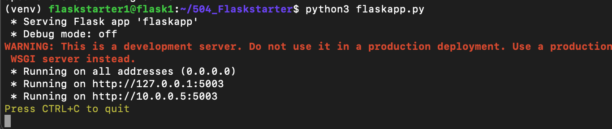

 

  
12. URL Status 
  
 

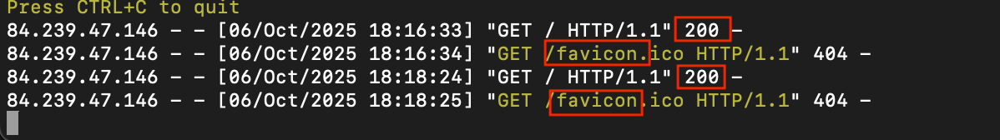

 

  
13. Webpage display 
  
 

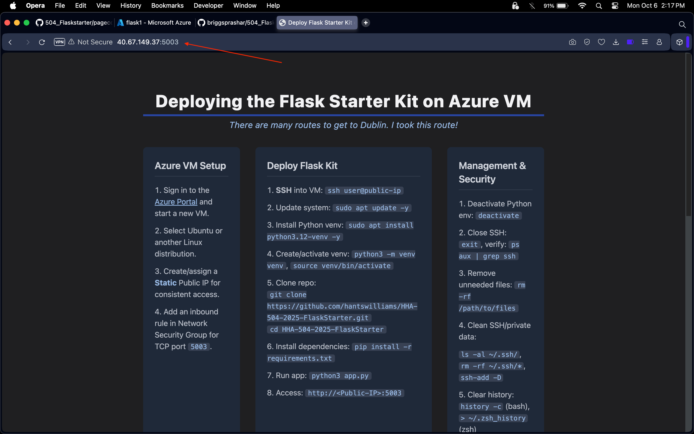

### Confirmation

  
14. Azure Shell
  

 

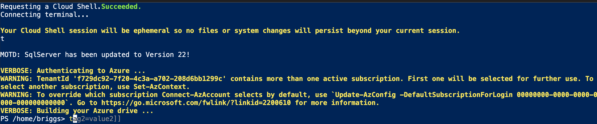

 

  
15. Azure status check prohibited
  

 

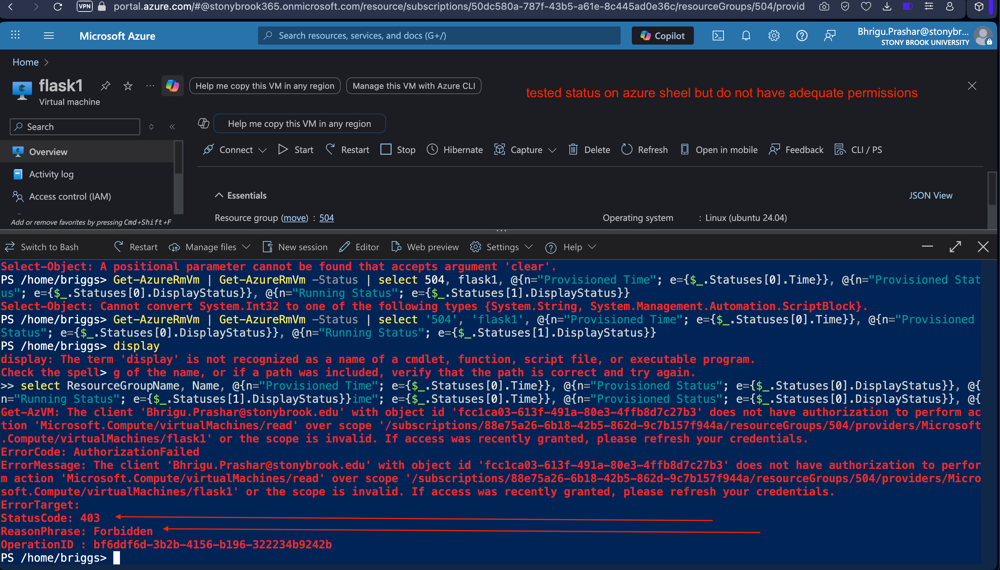

### Cleanup

  
16. Cleanup local machine 
  

 

Terminate the connection with the VM on local terminal with `CTRL + C` followed by exiting all processes with `Exit`

  
17. Stop Azure VM 
  

 

In Azure, under Virtual machines List, select **Stop** under virtual machine configuration options. Then confirm that it is stopped by visiting the **Dashboard**.

#### All commands on the webpage display at 

> 40.67.149.37:5003